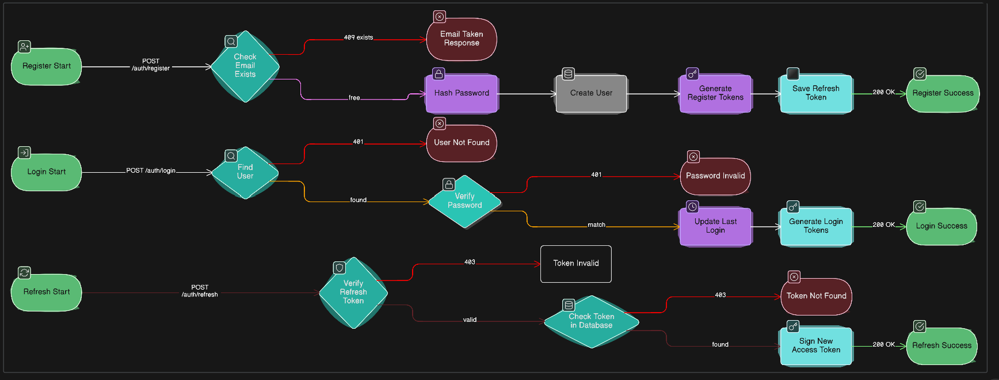

# Authentication

Zeal uses a self-contained JWT-based auth system. No third-party providers. Full control over every step.

---
## Endpoints

| Method | Route | 
|--------|-------|
| POST | `/api/auth/register` 
| POST | `/api/auth/login` 
| POST | `/api/auth/refresh` 

---

## Flow



## authMiddleware.js

```js
/**
 * @param {import('express').Request} req
 * @param {import('express').Response} res
 * @param {import('express').NextFunction} next
 */

```
# Function Signatures

```js
/**
 * Register a new user.
 * @param {import('express').Request} req - body: { email, password, full_name }
 * @param {import('express').Response} res
 * @returns {Promise}
 */
export const register = async (req, res) => { ... }

/**
 * Log in an existing user.
 * @param {import('express').Request} req - body: { email, password }
 * @param {import('express').Response} res
 * @returns {Promise}
 */
export const login = async (req, res) => { ... }

/**
 * Issue a new access token from a valid refresh token.
 * @param {import('express').Request} req - body: { refreshToken }
 * @param {import('express').Response} res
 * @returns {Promise}
 */
export const refresh = async (req, res) => { ... }

/**
 * Validate JWT from Authorization header and attach user to req.user.
 * @param {import('express').Request} req
 * @param {import('express').Response} res
 * @param {import('express').NextFunction} next
 * @returns {void}
 */
export const authMiddleware = (req, res, next) => { ... }
```

---

## Tokens

| | Access | Refresh |
|--|--|--|
| Expiry | 15min | 7d |
| Secret | `JWT_SECRET` | `JWT_REFRESH_SECRET` |
| Stored | localStorage | DB |

## Frontend keys
**env variables**

```
localStorage: zeal_access_token, zeal_refresh_token
localStorage key: zeal_refresh_token  → JWT refresh token
```
