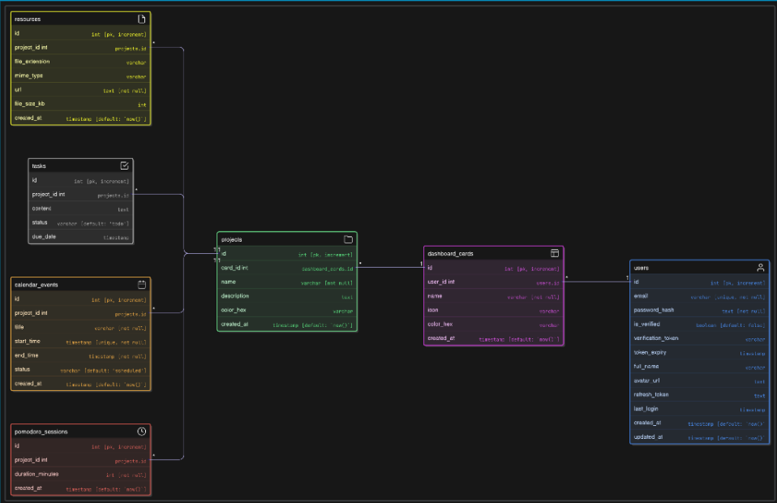

# Database

PostgreSQL + Drizzle ORM. Schema lives in `backend/src/db/schema.js`. The Drizzle instance is exported from `backend/src/db/index.js` and imported everywhere that needs DB access.

## Database layout


**6 tables: users, projects, dashboard_cards, tasks, pomodoro_sessions, resources**
# Migrations

| Command | When |
|---------|------|
| `npm run migrate` | After any schema change in development |
| `drizzle-kit generate` + `migrate` | Before any public/open-source release |

Always run migrations inside the node container:

```bash
docker compose exec node npm run migrate
```
**If you change a column name or type, re-run migrate — the DB will not auto-update.**
---

## Function Signatures

Every function that touches the DB should follow this pattern:

```js
/**
 * Get all tasks for a project.
 * @param {number} projectId
 * @returns {Promise<import('./schema.js').Task[]>}
 */
const getTasksByProject = async (projectId) => { ... }

/**
 * Insert a new task.
 * @param {{ content: string, projectId: number, status?: string }} data
 * @returns {Promise<import('./schema.js').Task>}
 */
const createTask = async (data) => { ... }
```

---

## Further Reading

[Drizzle ORM docs](https://orm.drizzle.team/docs/overview) — query syntax, relations, migrations


