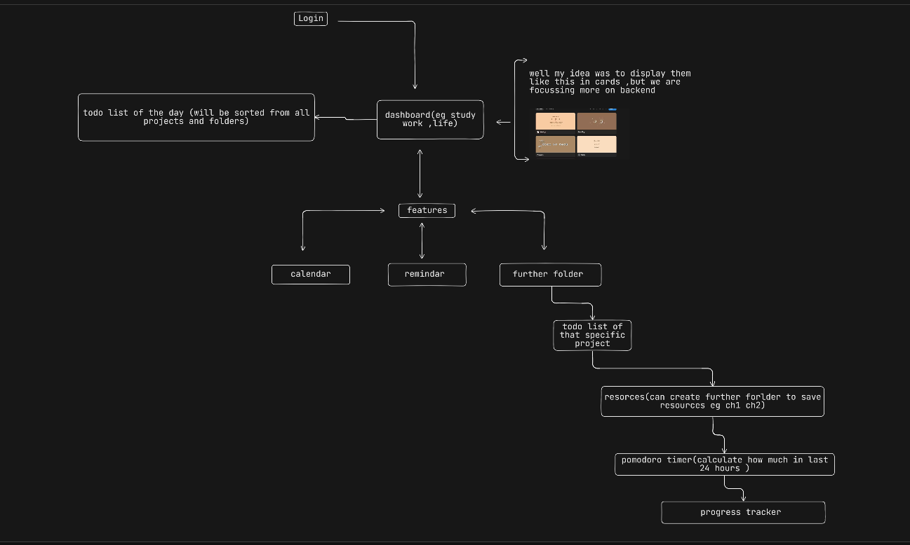

# Architecture
docs/
    
    architecture.md           # Current architecture overview
    Authentication.md         # Authentication flow
    DATABASE.md               # Database design
   
## Folder Structure

```
zeal/
├── backend/
│   ├── src/
│   │   ├── controllers/       # Route handlers (auth, projects, tasks…)
│   │   ├── routes/            # Express router definitions
│   │   ├── middleware/        # authMiddleware, errorHandler
│   │   ├── db/
│   │   │   ├── index.js       # Drizzle db instance (export this everywhere)
│   │   │   └── schema.js      # All table definitions + JSDoc typedefs
│   │   └── index.js           # Express entry point
│   ├── drizzle.config.js
│   ├── Dockerfile
│   └── package.json
│
├── frontend/
│   ├── shared/
│   │   └── store/
│   │       └── state.js       # Central state store
│   ├── views/                 # One file per view (auth, dashboard, board…)
│   ├── app.js                 # SPA entry point + router
│   └── index.html
│
├── nginx/
│   └── nginx.conf
│
├── .planning/                 # GSD project docs (not shipped)
├── docs/                      # This folder — contributor documentation
├── docker-compose.yml
├── .env.example
└── README.md
```


## project overview


**API request flows:**

```
Frontend fetch('/api/tasks')
  → Nginx proxy_pass → Express
  → authMiddleware  (validates JWT, attaches req.user)
  → route handler   (tasks.controller.js)
  → Drizzle query   (db.select().from(tasks).where(...))
  → JSON response
  → Frontend setState({ tasks: data })
  → render()
```
**Rule:** `render()` is the only function that touches the DOM. Controllers fetch data and call `setState()`. Nothing else.

## Docker Services

| Service | Image | Port | Purpose |
|---------|-------|------|---------|
| `postgres` | postgres:16 | 5432 (internal) | Database |
| `node` | custom Dockerfile | 3000 (internal) | Express API |
| `nginx` | nginx:alpine | 80 (host-exposed) | Reverse proxy + static files |

Environment variables are passed from `.env` into the `node` service only. See `.env.example` for required variables.